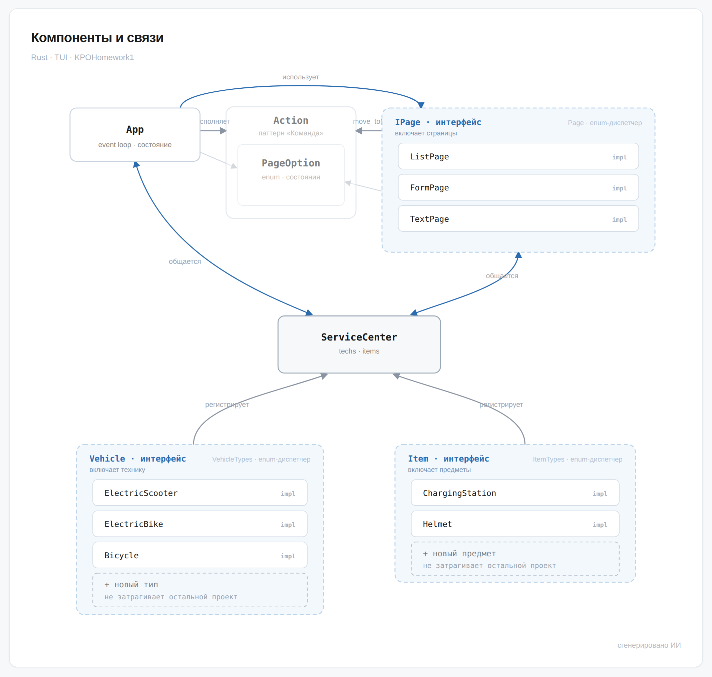

# KPOHomework1

Консольное TUI-приложение «Сервисный центр» на Rust для учёта электрического
транспорта (электросамокаты, электробайки), инвентаря (зарядные станции, шлемы),
техосмотра и статистики энергии. Интерфейс — на `ratatui`.

## Что сделал автор

- Прочел 500 страничную книгу про Rust
- Прочитал техзадание
- Выбрал архитектуру навигации: трейт `IPage` (интерфейс) + `enum Page`
  (закрытый набор видов страниц) + `Action`/`PageOption` как «намерения» переходов и тп
- Спроектировал доменную модель: трейты `Vehicle` и `Item`, типы
  `ElectricScooter`, `ElectricBike`, `ChargingStation`, `Helmet`, перечисления
  `VehicleTypes`/`ItemTypes` (типы-экраны с `unpack()`) и тп
- Разложил код по модулям (`service_center`, `service_center/items`,
  `service_center/vehicles`), перенёс `PageOption`/`Action` в `main`,
  убрал UI-зависимости из домена, вынес типы-единицы (`KWh`, `Wh`) в центр.
- Написал основную часть кода: страницы меню/списка/формы, ЖЦ приложения,
  сохранение и загрузку (`save`/`load`) через `serde` + `typetag`, страницу
  «О нас» и текст `about_us.txt`, настройку `.gitignore`. (да-да. автор не все подряд
  выйбкодил а большую часть кода написал руками!)
- Самостоятельно находил и разбирал ошибки компилятора, итерировал до рабочего
  состояния
- Добавил сериализацию в код
- Добавил мемного кота
- Несоклько раз прееделывал архитектуру и натыкался на ошибки
- Сделал редмишку

Для меня было реально ценно попрактиковаться в архитектуре и Rust коде - я доволен.

## Что сделал ИИ-ассистент

- Периодически объяснял концепции Rust (увы да. книгу прочел но практика есть практика)
- Починил конфликт версий зависимостей
- Исправлял ошибки компиляции тоже от части
- Реализовал часть кода по просьбе автора (обычно одну реализацию писал я а уже следующую ИИ-шка ну просто потому что там +- тоже самое)
- Настроил сериализацию: трейты на `#[typetag::serde]`
- Добавлял импорты/убирал неиспользуемые, устранял часть предупреждений
- Написал шаблон редмишки

## Паттерны проектировани
Состояния: `PageOption` - переключаем состояния и они сами знают какое вызывать следующее

Команда: `Action` - состояния возвращают не другое состояние а команду что сделать и куда переключиться

.... `::new()` - констурктор по умолчанию который вроде это тоже паттерн

DI: можно добавлять новые Item и Vehicle с ЛЮБЫМИ параметрами не меняя код в main.rs - код продолжит их корректно выводить и обрабатывать

DIP: разбита интерфейс страницы `IPage` и реализация конкретных типов страниц `FormPage`, `ListPage`, `TextPage` благодаря этому код отрисовки и обработки клавиш не дублируется по три раза

## Запуск

[Установка раста если еще нет (у них красивый сайт)](https://rust-lang.org/ru/tools/install/)

```sh
cargo run
```

## Тестирование

```sh
cargo test
```

## Общая схема архитектуры



Исходник схемы: [architecture.html](architecture.html)

## Ответы на вопросы

> какой принцип SOLID применён наиболее явно и где;
Скорей Dependency Inversion Principle (`Vehicle`, `Item`).


> какой принцип сознательно ограничен / «почти нарушен» и почему это приемлемо;
Наиболее ограниченный будет Single Responsibility Principle потому что `Vehicle`, `Item` передают как их отрисоввывать фактически. Это приемлимо потому что дает большую гибкость для DI без лишнего массива кода.

> что сломается (или не сломается) при добавлении нового вида транспорта, сотрудника или склада запчастей (можете придумать свой вариант расширения программы);
При добавлении новой сущности если интегрировать ее только в `ServiceCenter` ничего не сломается однако для нее нужно будет прописывать интерфейс в `App`; замечу что это сделать проще за счет шаблонных страниц: `ListPage` подойдет для просмотра содержимого, `FormPage` для ввода данных,  `TextPage` для вывода несписочной информации.
При добавлении нового транспорта или предмета нужно будте только реализовать их интерфейс в `items.rs` или `vehicles.rs` соответственно. После чего без изменения остальных файлов программы они станут доступны в приложении.

> какой тест фиксирует решение техосмотра и/или правило «для новичков»; как подменяется зависимость;
Техосмотр пока в разработке и тесты тоже

> что сделал ИИ, а что изменили вы (если ИИ не использовался — укажите это).
ответил выше
